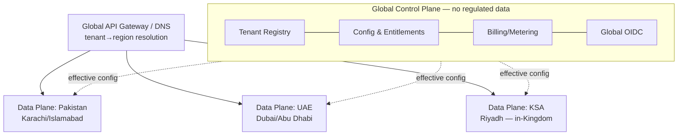

# Design 00 — Master Architecture

| | |
|---|---|
| **Blueprint** | Product Architecture Blueprint v3.1 (docx: `00_Master_Architecture_Blueprint_v3.docx`) |
| **Stack decision (v3.1)** | NestJS 10 / TypeScript (strict) default · Java 21 + Spring Boot 3.3 islands: Ledger (04), Pricing (10), FX adapter (17) |
| **Launch markets** | Pakistan (SBP/FMU) → UAE (CBUAE) → KSA (SAMA/SAFIU, in-Kingdom) |
| **Status** | Build-ready baseline, 8 July 2026 |

## 1. System context

Each data plane runs the full domain-service set in **cells** (deployment stamps). Tenancy: **bridge by default, silo on demand, pool where safe**. Tenant context (`tenant_id`) travels on every request, event, row, log line and metric.

## 2. Service & adapter map (with runtime)

| # | Component | Runtime | Design doc |
|---|---|---|---|
| 02 | Identity, KYC/KYB & Onboarding | NestJS/TS | `02_identity.design.md` |
| 03 | Screening & AML | NestJS/TS | `03_screening_aml.design.md` |
| 04 | **Ledger** | **Java 21/Spring Boot** | `04_ledger.design.md` |
| 05 | Payments & Remittance | NestJS/TS | `05_payments.design.md` |
| 06 | Wallets & Accounts | NestJS/TS | `06_wallets.design.md` |
| 07 | Card Issuing (optional) | NestJS/TS (Fastify auth path) | `07_cards.design.md` |
| 08 | Compliance Reporting | NestJS/TS | `08_compliance_reporting.design.md` |
| 09 | Reconciliation | NestJS/TS | `09_reconciliation.design.md` |
| 10 | **Pricing, Billing & Metering** | **Java 21/Spring Boot** | `10_pricing.design.md` |
| 11 | Developer Platform / Gateway / BFF | NestJS/TS | `11_dev_platform.design.md` |
| 12 | Tenant Registry & Control Plane | NestJS/TS | `12_control_plane.design.md` |
| 13 | Notification | NestJS/TS | `13_notification.design.md` |
| 14 | Persistence adapter | TS **and** Java impls | `14_persistence_adapter.design.md` |
| 15–16, 18–22 | Screening/eKYC/CoreBanking/Payout/CardProc/Msg/IdP adapters | TS | `NN_*.design.md` |
| 17 | **FX Rate adapter** | **Java library (in-process in 04/10)** | `17_fx_adapter.design.md` |

## 3. Invariant architectural rules (apply to every design doc)

1. **Hexagonal**: `domain/` imports nothing; `application/` imports domain+ports; only `adapters/` import technology libraries. Enforced by dependency-cruiser (TS) / ArchUnit (Java) — build-blocking.
2. **Money**: integer minor units everywhere. TS: `@platform/money` (`bigint` + dinero.js), native `number` banned for amounts by ESLint rule. Java: `Money(long amountMinor, Currency ccy)`.
3. **Events**: topic `‹capability›.‹entity›.‹event›.v‹n›`; envelope `{event_id, event_type, event_version, tenant_id, occurred_at, correlation_id, causation_id, payload}`; producers use the **transactional outbox** (Debezium relay); consumers idempotent by `event_id`.
4. **Idempotency**: every mutating API takes `Idempotency-Key`.
5. **Isolation**: enforced at the datastore (connection routing or RLS); cross-tenant access is a release-blocking P1, tested in CI (§19.3).
6. **Residency**: `home_region ∈ {pk, ae, sa}` routes to the tenant's data plane; KSA never leaves the Kingdom.
7. **Contracts**: OpenAPI 3.1 + Avro schemas first; Pact verification blocks CI on both sides of every boundary (mandatory across TS↔JVM seams).

## 4. Cross-cutting NFR anchors (§18)

p99 read < 800 ms · command < 1.5 s (excl. providers) · config resolution < 5 ms p99 · outbox lag p99 < 2 s · Enterprise RPO ≤ 5 min / RTO ≤ 30 min (cell) · isolation-test coverage 100 %, zero tolerance.

## 5. Reading order

Foundations: 01 → 12 → 22 → 14. Walking skeleton: 04 → 02 → 16. Compliance gate: 03 → 15. Money movement: 05 → 19 → 10 → 17. Surface: 06 → 11 → 13 → 21. Extended: 07 → 20 → 09 → 18 → 08. Index/build order: 23.
