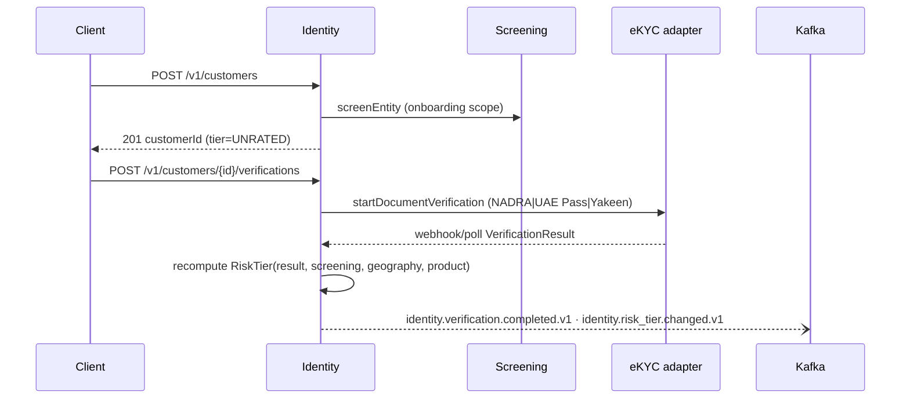

# Design 02 — Identity, KYC/KYB & Onboarding Service

**Runtime:** NestJS 10 / TS strict · **Squad:** Identity & Onboarding · **DB:** PostgreSQL 16 · **Docx:** `02_Service_Identity_KYC_KYB_Onboarding_Service.docx`

System of record for customers/businesses and their verification state; orchestrates eKYC adapters (16); emits risk tier consumed by Screening/Wallets/Payments. Launch: NADRA CNIC (PK), Emirates ID/UAE Pass (AE), Absher/Yakeen Iqama/National ID (SA).

## 1. Repo layout
Standard `service-template-ts` (see Design 01 §2). Notable adapters: `adapters/external/nadra.adapter.ts`, `uaepass.adapter.ts`, `yakeen.adapter.ts`, plus `mock-ekyc.adapter.ts` (sandbox).

## 2. Domain (src/domain)

```ts
export type CustomerId = Brand<string, 'CustomerId'>;
export type RiskTier = 'UNRATED' | 'LOW' | 'MEDIUM' | 'HIGH';

export class Customer {                      // aggregate root
  private constructor(readonly id: CustomerId, readonly tenantId: TenantId,
    readonly kind: 'RETAIL' | 'BUSINESS', private tier: RiskTier, private status: CustomerStatus) {}
  static register(cmd: RegisterCustomer): Customer;          // tier = UNRATED
  applyVerificationOutcome(o: VerificationOutcome, screening: ScreeningSignal): RiskTierChanged | null;
  // invariant: exactly one active tier; every change appended to history
}

export class VerificationCase {              // one journey with one provider
  readonly states = ['OPEN','EVIDENCE_SUBMITTED','PROVIDER_PENDING','APPROVED','REJECTED','MANUAL_REVIEW'] as const;
  // invariant: terminal states immutable — retry ⇒ new case
}

export interface Ubo { businessId: BusinessId; name: string; ownershipPct: number; status: UboStatus; }
// invariant: Σ ownershipPct checked against pack disclosure threshold on write
```

## 3. Ports

```ts
// inbound (use cases)
export interface RegisterCustomerUC { exec(ctx: TenantContext, cmd: RegisterCustomer): Promise<CustomerId>; }
export interface StartVerificationUC { exec(ctx: TenantContext, customerId: CustomerId, journey: JourneyType): Promise<CaseId>; }
export interface GetRiskTierUC { exec(ctx: TenantContext, id: CustomerId): Promise<RiskTierView>; }

// outbound
export interface EkycProviderPort {           // → Design 16
  startDocumentVerification(ctx: TenantContext, c: CustomerId, docs: DocumentImages): Promise<CaseRef>;
  startLivenessCheck(ctx: TenantContext, c: CustomerId, bio: BiometricCapture): Promise<CaseRef>;
  getVerificationResult(ctx: TenantContext, ref: CaseRef): Promise<VerificationResult>;
  lookupBusinessRegistry(ctx: TenantContext, regNo: string, jurisdiction: Iso3166): Promise<RegistryRecord>;
}
export interface ScreeningPort { screenEntity(ctx: TenantContext, e: EntityRef, s: ListScope): Promise<ScreeningResult>; } // → 03/15
export interface CustomerRepository { save(c: Customer): Promise<void>; byId(ctx: TenantContext, id: CustomerId): Promise<Customer | null>; } // → 14
export interface NotificationPort { send(ctx: TenantContext, t: TemplateKey, to: CustomerId, params: Json): Promise<void>; } // → 13/21
```

## 4. Onboarding sequence



Fail-safe: provider timeout ⇒ case → `MANUAL_REVIEW`, never auto-approve.

## 5. Data (DDL excerpt)

```sql
CREATE TABLE customers (
  id uuid PRIMARY KEY, tenant_id uuid NOT NULL, kind text NOT NULL,
  status text NOT NULL, risk_tier text NOT NULL DEFAULT 'UNRATED', created_at timestamptz NOT NULL);
CREATE TABLE customer_history (customer_id uuid, changed_at timestamptz, field text, old_v jsonb, new_v jsonb, actor text);
CREATE TABLE verification_cases (
  id uuid PRIMARY KEY, customer_id uuid NOT NULL, provider_adapter text NOT NULL,
  status text NOT NULL, outcome text, evidence_ref text,     -- object-storage pointer; PII never inline
  created_at timestamptz NOT NULL);
CREATE TABLE ubos (id uuid PRIMARY KEY, business_id uuid, name text, ownership_pct numeric(5,2), verification_status text);
```

Isolation per tenant tier (Design 14); `tenant_id` present even under silo (defence-in-depth).

## 6. API / Events
API: `POST /v1/customers` · `POST /v1/customers/{id}/verifications` · `POST /v1/verifications/{caseId}/evidence` (multipart) · `GET /v1/customers/{id}/risk-tier` · `POST /v1/businesses/{id}/ubos`.
Publishes `identity.customer.registered.v1`, `identity.verification.completed.v1`, `identity.risk_tier.changed.v1`; consumes `screening.case.resolved.v1` (tier recompute). Outbox on all.

## 7. Config & NFRs
From compliance pack: verification level per product (PK: NADRA-CNIC for Standard; AE: Emirates ID; SA: Iqama/National ID), UBO threshold (default 25 %), re-review cadence per tier. NFRs: happy-path journey p95 < 90 s incl. provider; evidence crypto-shredded on erasure.

## 8. Tests
Unit: tier recompute matrix (property-based over inputs). Component: Testcontainers PG + WireMock eKYC (success/timeout/reject). Contract: Pact consumer of 15/16, provider to BFF. Isolation suite per §19.3. Certification fixtures: valid/expired/tampered/face-mismatch docs per market.
