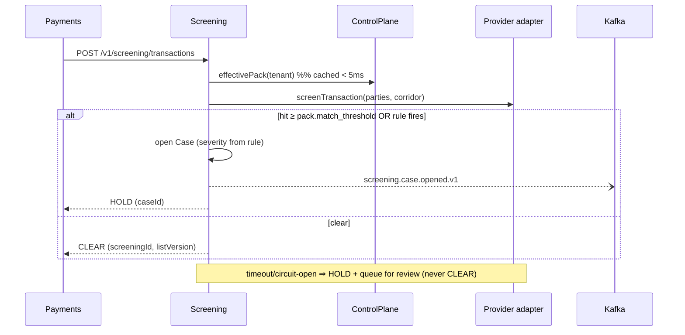

# Design 03 — Screening & AML Service

**Runtime:** NestJS 10 / TS strict · **Squad:** Compliance & AML · **DB:** PostgreSQL 16 + OpenSearch · **Docx:** `03_Service_Screening_AML_Service.docx`

Compliance gate for onboarding and every money movement. List scope per pack — launch minimum: UN Consolidated, OFAC SDN, plus domestic lists (PK NACTA proscribed persons, UAE Local Terrorist List, KSA designated persons). **Fail-safe closed:** a screening failure is a HOLD, never a pass.

## 1. Domain

```ts
export class ScreeningRequest {          // immutable once resolved; re-screen ⇒ new request
  readonly id: ScreeningId; readonly tenantId: TenantId;
  readonly entity: EntityRef; readonly listScope: ListScope;
  readonly result?: ScreeningResult;     // { hits: Hit[]; score: number; listVersion: string }
}

export class Case {                      // investigation aggregate
  // state machine — transitions validated in domain, persisted transactionally
  status: 'OPEN'|'INVESTIGATING'|'ESCALATED'|'CLEARED'|'CLOSED';
  disposition(decision: Decision, maker: PrincipalId, checker?: PrincipalId) {
    if (this.severity === 'HIGH' && !checker) throw new MakerCheckerRequired();
    ...
  }
}

export interface MonitoringRule {        // versioned decision-table row from the pack
  id: RuleId; packId: PackId; version: number; effectiveFrom: Date;
  definition: DecisionTable;             // evaluated, never mutated in place
}
```

## 2. Ports

```ts
// inbound
export interface ScreenEntityUC { exec(ctx: TenantContext, e: EntityRef, scope?: ListScope): Promise<ScreeningResult>; }
export interface EvaluateTransactionUC { exec(ctx: TenantContext, tx: TransactionFacts): Promise<MonitoringOutcome>; }
export interface DispositionCaseUC { exec(ctx: TenantContext, id: CaseId, d: Decision, approver?: PrincipalId): Promise<void>; }

// outbound
export interface ScreeningProviderPort {                    // → Design 15
  screenEntity(e: NormalizedEntity, lists: ListScope): Promise<ProviderResult>;
  screenTransaction(parties: Parties, corridor: Corridor): Promise<ProviderResult>;
  getListVersion(): Promise<ListVersion>;
}
export interface ConfigPort { effectivePack(ctx: TenantContext): Promise<CompliancePack>; }  // → 12
export interface CaseRepository extends TenantScopedRepo<Case> {}                             // → 14
```

Rule evaluation: decision-table engine in `domain/rules/` (pure TS, no I/O) fed by pack-versioned tables; authorization-style rules delegated to OPA sidecar via `PolicyPort` where relevant.

## 3. Transaction-screening path (called inside the send-money saga)



## 4. Data

```sql
CREATE TABLE screening_requests (
  id uuid PRIMARY KEY, tenant_id uuid NOT NULL, entity_ref jsonb NOT NULL,
  list_scope text[] NOT NULL, result jsonb, list_version text, resolved_at timestamptz
) PARTITION BY RANGE (resolved_at);          -- tenant+month retention management
CREATE TABLE cases (id uuid PK, tenant_id uuid, status text, severity text,
  assignee text, trigger jsonb, opened_at timestamptz, closed_at timestamptz, approver text);
CREATE TABLE monitoring_rules (id uuid, pack_id uuid, version int, definition jsonb,
  effective_from timestamptz, PRIMARY KEY (id, version));
```

OpenSearch mirror of `cases` for investigator search (indexer consumes own outbox events).

**Isolation note:** case data always DB-/schema-per-tenant for Enterprise & Standard regardless of general tier.

## 5. API / Events
`POST /v1/screening/entities` · `POST /v1/screening/transactions` · `GET /v1/cases/{id}` · `POST /v1/cases/{id}/disposition` (maker-checker on HIGH).
Publishes `screening.case.opened.v1|resolved.v1`, `screening.transaction.flagged.v1`; consumes `identity.customer.registered.v1`, `payments.transfer.initiated.v1`.

## 6. NFRs & guardrails
Real-time screen p99 < 700 ms excl. provider · zero false-negative tolerance on mandatory lists (P1) · retention per pack (5–10 y). dependency-cruiser + strict TS; every result stores `listVersion` for audit replay.

## 7. Tests
Fixture scenario suite (known sanctioned/clean names per market list) — pack-certification blocking. WireMock provider (hit/clear/timeout/5xx). Property tests on decision-table evaluator. Pact: provider→Payments/Identity; consumer→15. Isolation suite §19.3.
