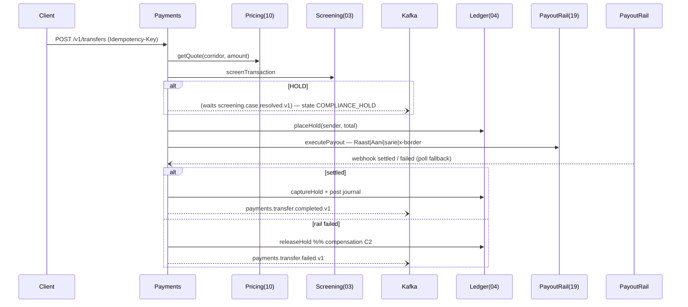

# Design 05 — Payments & Remittance Service

**Runtime:** NestJS 10 / TS strict · **Squad:** Payments & Remittance · **DB:** PostgreSQL 16 · **Docx:** `05_Service_Payments_Remittance_Service.docx`

Orchestrates the send-money saga: quote → screen → hold → payout → confirm, with explicit compensation. Launch corridors: **UAE→PK, KSA→PK** (primary), reverse, and domestic via Raast (PK) / Aani (AE) / sarie (SA). Saga = persisted state machine + choreography — no heavyweight engine.

## 1. Domain

```ts
export type TransferState =
  | 'INITIATED' | 'QUOTED' | 'SCREEN_CLEAR' | 'COMPLIANCE_HOLD'
  | 'FUNDS_HELD' | 'PAYOUT_SENT' | 'IN_FLIGHT' | 'SETTLED'
  | 'COMPENSATING' | 'FAILED' | 'CANCELLED';

export class Transfer {                                  // aggregate root
  private constructor(readonly id: TransferId, readonly tenantId: TenantId,
    readonly corridor: Corridor, readonly amount: Money, private state: TransferState,
    private refs: { quoteId?: QuoteId; screeningId?: ScreeningId; holdId?: HoldId; payoutRef?: PayoutRef }) {}

  // every transition validates precondition + persists atomically with an outbox row
  markQuoted(q: QuoteId): DomainEvent[];       // INITIATED→QUOTED
  markScreenClear(s: ScreeningId): DomainEvent[];
  markFundsHeld(h: HoldId): DomainEvent[];
  markPayoutSent(p: PayoutRef): DomainEvent[]; // FUNDS_HELD→PAYOUT_SENT→IN_FLIGHT
  settle(): DomainEvent[];                     // capture hold + terminal
  compensate(reason: FailReason): CompensationPlan;  // explicit step list, see §4
}
export interface Corridor { source: Iso3166; dest: Iso3166; boundAdapter: RailKey; } // config, not code
```

Amounts: `@platform/money` only; ESLint money rule active.

## 2. Ports

```ts
// inbound
export interface InitiateTransferUC { exec(ctx: TenantContext, cmd: InitiateTransfer, key: IdempotencyKey): Promise<TransferId>; }
export interface CancelTransferUC   { exec(ctx: TenantContext, id: TransferId): Promise<void>; } // only while cancellable

// outbound
export interface PricingPort   { getQuote(ctx: TenantContext, op: QuoteRequest): Promise<Quote>; }        // → 10 (JVM, REST — Pact-locked)
export interface ScreeningPort { screenTransaction(ctx: TenantContext, f: TransactionFacts): Promise<ScreenOutcome>; } // → 03
export interface LedgerPort    { placeHold(...): Promise<HoldId>; captureHold(...): Promise<void>;
                                 releaseHold(...): Promise<void>; post(...): Promise<JournalId>; }         // → 04 (JVM — Pact-locked)
export interface PayoutPort    { executePayout(ctx: TenantContext, i: PayoutInstruction): Promise<PayoutRef>;
                                 getPayoutStatus(ref: PayoutRef): Promise<PayoutStatus>; }                 // → 19
export interface TransferRepository extends TenantScopedRepo<Transfer> { saveWithSagaStep(t: Transfer, step: SagaStep): Promise<void>; }
```

## 3. Saga (happy path + compensation triggers)



Compensations: screen-fail⇒cancel quote (C1) · rail-reject⇒release hold (C2) · settlement-fail⇒reverse journal + rail refund path (C3). Each is an idempotent saga step in `saga_steps`.

## 4. Data

```sql
CREATE TABLE transfers (id uuid PK, tenant_id uuid NOT NULL, corridor text NOT NULL,
  state text NOT NULL, amount_minor bigint NOT NULL, currency char(3) NOT NULL,
  quote_id uuid, screening_id uuid, hold_id uuid, payout_ref text,
  idempotency_key text NOT NULL, UNIQUE (tenant_id, idempotency_key));
CREATE TABLE saga_steps (transfer_id uuid, step text, status text, attempt int,
  last_error text, executed_at timestamptz, PRIMARY KEY (transfer_id, step));
CREATE TABLE transfer_history (transfer_id uuid, at timestamptz, from_state text, to_state text, cause text);
CREATE TABLE beneficiaries (id uuid PK, tenant_id uuid, customer_id uuid, corridor text,
  details jsonb, verification_status text);
CREATE TABLE corridors (id text PK, source char(2), dest char(2), bound_adapter text, active bool);
-- seed: AE→PK:xborder · SA→PK:xborder · PK→PK:raast · AE→AE:aani · SA→SA:sarie
```

## 5. API / Events
`POST /v1/transfers` (202) · `GET /v1/transfers/{id}` (status + itemised quote) · `POST /v1/transfers/{id}/cancel` · `POST /v1/beneficiaries` (corridor-validated).
Publishes `payments.transfer.initiated|completed|failed.v1`; consumes `screening.case.resolved.v1`, `ledger.hold.captured|released.v1`.

## 6. NFRs & guardrails
Domestic happy path p95 < 5 s, x-border < 60 s (excl. rail) · idempotency 100 % · state machine preconditions enforced in domain (out-of-order retries impossible) · IN_FLIGHT is a first-class state — a rail timeout is never assumed success **or** failure.

## 7. Tests
Saga component test with all three fault injections (screen-hold, rail-reject, settle-fail) asserting exact compensation set. Idempotent double-submit. Pact: consumer→03/04/10/19 (JVM seams blocking). Corridor cut-off/value-dating calendar tests per market.
