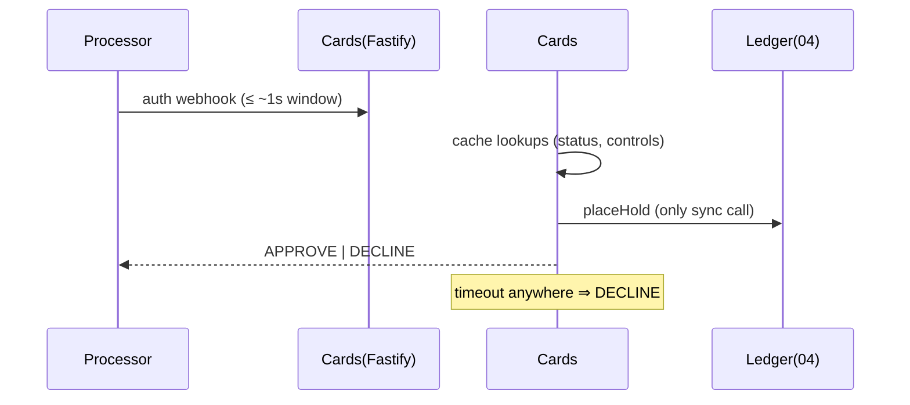

# Design 07 — Card Issuing Service (optional capability)

**Runtime:** NestJS 10 / TS strict — **authorization webhook on FastifyAdapter** · **Squad:** Accounts & Cards · **Docx:** `07_Service_Card_Issuing_Service_Optional_Capability.docx`

Virtual/physical issuance + real-time authorization via processor adapter (20). Tokenised refs only — raw PAN never touches platform storage (PCI scope reduction). **Timeout ⇒ DECLINE** (fail-safe closed).

## 1. Domain

```ts
export class Card {
  status: 'ACTIVE' | 'FROZEN' | 'CLOSED';      // CLOSED is terminal — never reactivated
  readonly tokenisedRef: TokenRef;             // processor token; no PAN anywhere
}
export interface SpendControl { cardId: CardId; type: 'LIMIT'|'MCC'|'GEO'; value: Json; version: number; }

export class AuthorizationDecision {
  static decide(card: Card, controls: SpendControl[], req: AuthRequest, holdResult: HoldOutcome): 'APPROVE'|'DECLINE' {
    if (card.status !== 'ACTIVE') return 'DECLINE';
    if (!passesControls(controls, req)) return 'DECLINE';
    return holdResult.ok ? 'APPROVE' : 'DECLINE';
  }
}
```

## 2. Ports

```ts
export interface CardProcessorPort {                             // → Design 20
  issueCard(ctx: TenantContext, accountId: AccountId, kind: CardKind, delivery?: Delivery): Promise<TokenRef>;
  freeze(ref: TokenRef): Promise<void>; close(ref: TokenRef): Promise<void>;
}
export interface LedgerPort { placeHold(ctx: TenantContext, acct: LedgerAccountId, m: Money, key: IdempotencyKey): Promise<HoldOutcome>; } // → 04
```

## 3. Hot path — authorization webhook (Fastify)

```ts
// adapters/rest/auth-webhook.controller.ts — registered on the FastifyAdapter route
// Budget: p99 < 400 ms platform-side inside the processor window.
// Precomputed & cached at edge: card status, spend controls (invalidated on change events).
// The ONLY synchronous call is Ledger.placeHold. Everything else is lookup-from-cache.
@Post('/v1/cards/authorizations')
async authorize(@Body() p: ProcessorAuthPayload): Promise<AuthResponse> {
  const card = this.cardCache.get(p.tokenRef);               // in-memory, event-invalidated
  const hold = await this.ledger.placeHold(ctx(card), card.ledgerAccountId,
      money(p.amountMinor, p.currency), idem(p.authId));
  const d = AuthorizationDecision.decide(card, this.controlsCache.get(card.id), p, hold);
  if (d === 'DECLINE' && hold.ok) this.compensator.enqueueRelease(hold.holdId);  // async, idempotent
  return { decision: d };
}
```



## 4. Data

```sql
CREATE TABLE cards (id uuid PK, tenant_id uuid, account_id uuid, tokenised_ref text UNIQUE, status text);
CREATE TABLE spend_controls (card_id uuid, control_type text, value jsonb, version int,
  PRIMARY KEY (card_id, control_type, version));
CREATE TABLE authorizations (id uuid PK, card_id uuid, amount_minor bigint, currency char(3),
  decision text, reason text, processed_at timestamptz);   -- retention per pack; NO PAN columns exist
```

## 5. API / Events / NFRs / Tests
`POST /v1/cards` · `POST /v1/cards/{id}/freeze` · `PUT /v1/cards/{id}/controls` · internal auth webhook above.
Events: `cards.card.issued.v1`, `cards.authorization.declined.v1`; consumes `wallets.account.closed.v1` (auto-close).
NFRs: auth p99 < 400 ms platform-side; tier-critical availability. Tests: load test on the Fastify route at 3× peak; timeout⇒DECLINE fault injection; duplicate-auth idempotency; PCI scope check — grep/CI rule asserting no PAN-shaped column or log field; Pact consumer→04/20.
