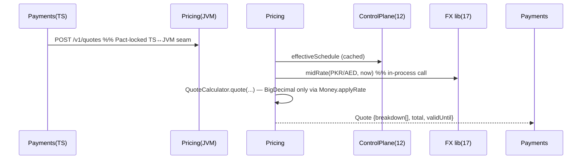

# Design 10 — Pricing, Billing & Metering Service ★ JVM island

**Runtime:** Java 21 + Spring Boot 3.3 (deliberate, per v3.1 §11.1) · **Squad:** Pricing & Billing · **Docx:** `10_Service_Pricing_Billing_Metering_Service.docx`

Deterministic, explainable quotes (fees, commission, FX margin, tax, promotions) + usage metering → invoicing. Stays on the JVM: BigDecimal quote math, ArchUnit, and it consumes the FX adapter (17) **in-process** — no network hop on the quote path.

## 1. Domain

```java
public record Quote(QuoteId id, TenantId tenant, Operation op,
                    List<QuoteLine> breakdown, Money total,
                    RateSnapshot fx, Instant issuedAt, Instant validUntil) { }
// invariant: immutable; expiry forces re-quote — a quote binds a rate snapshot
// ADR-0002 D1: fx_snapshot is the AUTHORITATIVE record of rate_mid + margin + customer rate.
// Ledger journals reference it via journals.quote_id; the Ledger never re-derives a rate.

public record QuoteLine(LineType type, String label, Money amount) { } // BASE|FEE|COMMISSION|FX_MARGIN|TAX|PROMO

public final class QuoteCalculator {          // pure domain — the reason this service is Java
  public Quote quote(FeeSchedule fs, Money principal, Rate mid, Margin margin, TaxRule tax, List<Promo> promos) {
    Money fee   = fs.apply(principal);                                   // flat|pct|tiered, minor-unit exact
    Money fx    = principal.applyRate(margin.asBigDecimal(), HALF_EVEN); // sole decimal gateway
    Money taxed = tax.on(fee.add(fx));
    ...
    // Σ breakdown MUST equal total — enforced in constructor, property-tested
  }
}

public record FeeSchedule(ScheduleId id, Scope scope, int version, Instant effectiveFrom, List<Tier> tiers) { }
public record UsageRecord(EventId id, TenantId t, UsageType type, long qty, Instant at) { } // immutable, aggregated only
```

## 2. Ports

```java
public interface QuoteCommands { Quote getQuote(TenantContext ctx, QuoteRequest req); }        // inbound (REST for TS consumers)
public interface UsageIngest   { void record(TenantContext ctx, UsageEvent e); }               // Kafka consumer + REST

public interface FxRatePort  { Rate midRate(CurrencyPair p, Instant asOf); }                   // → Design 17 — in-process JVM library
public interface ConfigPort  { FeeSchedule effectiveSchedule(TenantContext ctx, Scope s); }    // → 12 (REST, cached)
public interface QuoteRepository { void save(Quote q); Optional<Quote> byId(TenantContext ctx, QuoteId id); } // → 14 (Java impl)
```

## 3. Quote flow



## 4. Data

```sql
CREATE TABLE quotes (id uuid PK, tenant_id uuid, operation text, breakdown jsonb NOT NULL,
  total_minor bigint, currency char(3), fx_snapshot jsonb, issued_at timestamptz, valid_until timestamptz,
  funding_currency char(3));   -- ADR-0002 D3: the currency the customer is charged in; the FX spread
                               -- is recognised in FX-Revenue-<funding_currency>. Recorded, not inferred.
CREATE TABLE fee_schedules (id uuid, tenant_id uuid, scope jsonb, version int,
  effective_from timestamptz, definition jsonb, PRIMARY KEY (id, version));
CREATE TABLE usage_records (id uuid PK, tenant_id uuid, event_type text, quantity bigint,
  occurred_at timestamptz) PARTITION BY RANGE (occurred_at);
CREATE TABLE invoices (id uuid PK, tenant_id uuid, period daterange, total_minor bigint, currency char(3), lines jsonb);
```

## 5. API / Events / NFRs
`POST /v1/quotes` (itemised breakdown) · `POST /v1/usage` (idempotent by event_id, high volume) · `GET /v1/invoices/{tenant}/{period}`.
Publishes `pricing.quote.issued.v1`, `billing.invoice.generated.v1`; consumes `payments.transfer.completed.v1`, `screening.case.opened.v1` (billable events).
NFRs: quote p99 < 100 ms · usage ingestion sized to 3× peak · quote/execute drift prevented by rate-snapshot binding + `validUntil`.

## 6. Tests
jqwik property suite: Σ breakdown == total for arbitrary schedules/amounts; tiered-boundary exactness; rounding table per currency (PKR/AED/SAR = 2 dp). Determinism test: same inputs+snapshot ⇒ byte-identical breakdown. ArchUnit gate. Pact **provider** for Payments/Wallets/Cards (TS consumers) — blocking. Testcontainers PG + embedded Kafka for usage ingestion.
