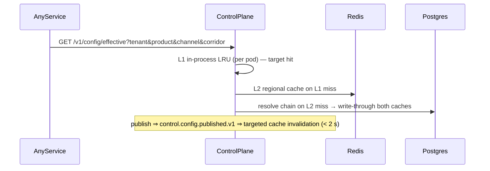

# Design 12 — Tenant Registry & Control-Plane Service

**Runtime:** NestJS 10 / TS strict · **Squad:** Platform / Enablement · **DB:** PostgreSQL 16 + Redis (+ in-process LRU) · **Docx:** `12_Service_Tenant_Registry_Control_Plane_Service.docx`

The tenant-agnostic brain: registry, hierarchical config store/resolver, entitlements, onboarding orchestration. Holds **no regulated customer data**. Hot path (`resolveEffectiveConfig`) is every service's dependency — treated tier-critical; consumers fail safe on cache-stale, never hard-fail on a live call.

## 1. Domain

```ts
export class Tenant {
  status: 'PROVISIONING' | 'ACTIVE' | 'SUSPENDED' | 'OFFBOARDING';
  readonly tier: 'ENTERPRISE' | 'STANDARD' | 'STARTER';
  readonly homeRegion: 'pk' | 'ae' | 'sa';           // residency routing key (Design 14)
  // destructive transitions require maker-checker; all transitions audited
}

export interface ConfigurationVersion {              // immutable; publish = new version
  scope: Scope;                                      // GLOBAL→REGION→TENANT→PRODUCT→CHANNEL→CORRIDOR
  version: number; hash: string; effectiveFrom: Date;
  values: Json; approvedBy: PrincipalId;
}

// Merge semantics (domain-pure resolver):
// scalars: most-specific wins · maps: deep merge · lists: replace|append|remove (default replace)
// sentinels distinguish "inherit" vs "explicitly cleared"
export function resolveEffective(chain: ConfigurationVersion[], at: Date): EffectiveConfig;
```

## 2. Ports

```ts
export interface RegisterTenantUC   { exec(cmd: RegisterTenant): Promise<TenantId>; }     // starts onboarding workflow (§16)
export interface PublishConfigUC    { exec(scope: Scope, values: Json, maker: PrincipalId, checker: PrincipalId): Promise<VersionId>; }
export interface ResolveConfigUC    { exec(t: TenantId, p?: ProductId, ch?: Channel, c?: Corridor): Promise<EffectiveConfig>; }
export interface GrantEntitlementUC { exec(t: TenantId, cap: Capability, maker: PrincipalId, checker: PrincipalId): Promise<void>; }

export interface IaCTriggerPort { provisionTenant(t: Tenant): Promise<PipelineRunRef>; }  // GitOps pipeline trigger
export interface IdentityProviderPort { createTenantRealm(t: TenantId, cfg: RealmCfg): Promise<RealmRef>; } // → 22
```

## 3. The hot path — resolution & invalidation



Budget: **p99 < 5 ms** on cache hit (why L1 LRU exists in front of Redis).

Config lifecycle: author → schema+range validation + policy lint → maker-checker → **publish immutable version** (effective-dated) → promote dev→sandbox→staging→canary-cohort→prod → one-click rollback to previous known-good.

## 4. Data

```sql
CREATE TABLE tenants (id uuid PK, name text, tier text, home_region char(2)
  CHECK (home_region IN ('pk','ae','sa')), status text, created_at timestamptz);
CREATE TABLE config_versions (id uuid PK, scope jsonb NOT NULL, version int NOT NULL,
  hash text NOT NULL, values jsonb NOT NULL, effective_from timestamptz NOT NULL,
  maker text NOT NULL, checker text NOT NULL, published_at timestamptz,
  UNIQUE (scope, version));                          -- immutable rows; no UPDATE grant
CREATE TABLE entitlements (tenant_id uuid, capability text, granted_at timestamptz,
  PRIMARY KEY (tenant_id, capability));
CREATE TABLE audit_log (at timestamptz, actor text, action text, subject jsonb, approver text);
```

Control plane runs **pooled, single-region-primary + read replicas** — inverse posture to the data planes it manages (no regulated data here).

## 5. API / Events / Tests
`POST /v1/tenants` · `POST /v1/config` · `GET /v1/config/effective` (hot) · `POST /v1/entitlements`.
Publishes `control.tenant.registered|activated|suspended.v1`, `control.config.published.v1`.
Tests: resolver property suite (merge semantics: scalar/deep-merge/list strategies, inherit-vs-clear sentinels); effective-dating boundary cases; invalidation-latency test (< 2 s); maker=checker rejection; entitlement enforcement Pact with gateway; load test on the resolve endpoint at 3× fleet peak.
