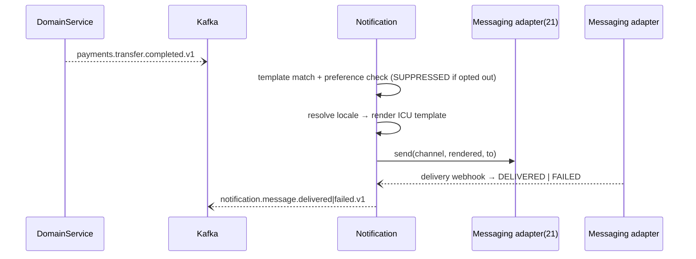

# Design 13 — Notification Service

**Runtime:** NestJS 10 / TS strict · **Squad:** Developer Platform · **DB:** PostgreSQL 16 · **Docx:** `13_Service_Notification_Service.docx`

Tenant-branded, localized customer communication over SMS/email/push/in-app via messaging adapters (21). Owns templates, locale resolution, preference/consent, and delivery tracking. **Transactional only at launch** — marketing consent categories are modelled but campaign tooling is out of scope.

## 1. Domain

```ts
export interface Template {                      // versioned per tenant + locale
  key: TemplateKey; tenantId: TenantId; locale: Locale;      // en-PK | ur-PK | ar-AE | ar-SA (+ en-* fallback)
  channel: Channel; body: IcuMessage; version: number;       // ICU MessageFormat; RTL flag derived from locale
}
export class NotificationRequest {               // idempotent by (tenantId, dedupeKey)
  status: 'ACCEPTED' | 'RENDERED' | 'SENT' | 'DELIVERED' | 'FAILED' | 'SUPPRESSED';
  render(t: Template, params: Json): RenderedMessage;        // missing param ⇒ FAILED, never blank-filled
}
export interface Preference { customerId: CustomerId; channel: Channel; category: 'TXN'|'SECURITY'|'MARKETING'; optedIn: boolean; }
// invariant: SECURITY category cannot be opted out; MARKETING requires explicit opt-in per market rules
```

## 2. Ports

```ts
export interface SendNotificationUC { exec(ctx: TenantContext, req: SendRequest): Promise<NotificationId>; }
export interface MessagingPort {                                   // → Design 21
  send(ctx: TenantContext, channel: Channel, msg: RenderedMessage, to: Address): Promise<ProviderRef>;
}
export interface TemplateRepository extends TenantScopedRepo<Template> {}
export interface PreferencePort { allows(ctx: TenantContext, c: CustomerId, ch: Channel, cat: Category): Promise<boolean>; }
```

Locale chain mirrors Design 11: explicit request locale → customer pref → tenant default → `en-*`. Urdu (`ur-PK`) templates render RTL with Nastaliq-capable email/push styling; Arabic (`ar-AE`, `ar-SA`) RTL.

## 3. Flow



Retry: exp backoff ×3 per provider → failover to secondary provider binding (SPI registry) → FAILED + alert.

## 4. Data

```sql
CREATE TABLE templates (key text, tenant_id uuid, locale text, channel text,
  body text NOT NULL, version int, PRIMARY KEY (key, tenant_id, locale, channel, version));
CREATE TABLE notifications (id uuid PK, tenant_id uuid, customer_id uuid, template_key text,
  channel text, status text, dedupe_key text, provider_ref text, created_at timestamptz,
  UNIQUE (tenant_id, dedupe_key));
CREATE TABLE preferences (customer_id uuid, channel text, category text, opted_in bool,
  updated_at timestamptz, PRIMARY KEY (customer_id, channel, category));
```

Body params containing PII are **not** persisted — only the rendered-message object-storage ref where a pack requires archival.

## 5. API / Events / NFRs / Tests
`POST /v1/notifications` (idempotent by dedupe key) · `PUT /v1/templates/{key}` (versioned publish) · `PUT /v1/customers/{id}/preferences`.
Publishes `notification.message.sent|delivered|failed.v1`; consumes domain topics per template-trigger config.
NFRs: security/OTP messages p95 < 5 s end-to-end · delivery success > 99 % within retry budget.
Tests: ICU rendering matrix across all four launch locales incl. RTL snapshot tests; missing-param ⇒ FAILED; SECURITY opt-out rejection; provider failover component test (primary 5xx ⇒ secondary); Pact consumer→21.
