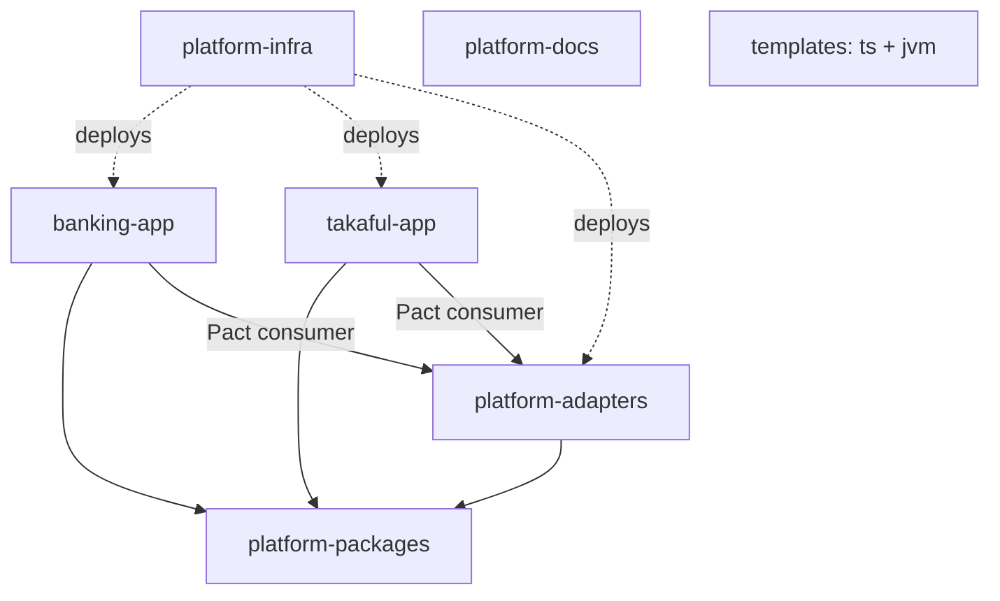

# Design 28 — Repository Catalog & Specification

**Platform:** GitHub (one org, team-based access) · **Companion to:** Doc 27 (branching/CI/environments) · **Status:** ready to execute · **Docx:** `28_Repository_Catalog_and_Specification.docx`

The definitive per-repo reference: name, purpose, contents, structure, dependencies, ownership, versioning, and what must **not** go in each.

## 1. The eight repos (3 tiers)

| Tier | Repo | Purpose | Depends on | Versioning |
|---|---|---|---|---|
| Template | `service-template-ts` | NestJS golden path (copied) | — | GitHub template |
| Template | `service-template-jvm` | Spring Boot golden path (Ledger/Pricing only) | — | GitHub template |
| Foundation | `platform-packages` | `@platform/{money,tsconfig,telemetry,oidc,persistence-ts,pact-fixtures}` | nothing internal | Changesets, per-package semver |
| Foundation | `platform-adapters` | network-boundary shared adapters (15·16·18·19·20·21·24·25·26) | packages | `adapter-<name>-vX.Y.Z` |
| Product | `banking-app` | banking domain — TS services + JVM (Ledger/Pricing) + FX & persistence-java libs | packages, adapters | `banking-vX.Y.Z` |
| Product | `takaful-app` | takaful domain (policy/underwriting/claims/pool/BFF) | packages, adapters | `takaful-vX.Y.Z` |
| Operational | `platform-infra` | Terraform modules + ArgoCD GitOps overlays | (deploys images) | apply/sync by PR |
| Operational | `platform-docs` | blueprints, design.md, ADRs, RFCs | — | merge = published |

## 2. Dependency graph (DAG — never cyclic)

Only downward deps. A dep from `platform-adapters` → an app, or from `platform-packages` → anything, is a **cycle** and is rejected in review.

## 3. Three placements that are NOT where you'd guess ⚠️
- **FX (17)** = Java in-process library → lives in **banking-app** (`jvm/libs/fx`), not platform-adapters.
- **OIDC (22)** = client library → **platform-packages** as `@platform/oidc`, not a deployable adapter.
- **Persistence (14)** = dual-language → TS form `@platform/persistence-ts` in platform-packages; Java form `jvm/libs/persistence` in banking-app.
- Rule: "adapter" in the hexagonal sense ≠ "a deployable service in platform-adapters".

## 4. Repo internals (key structure)

- **platform-packages:** `packages/<name>/{src,test,package.json}` + `.changeset/`. Never: business logic, running services, app-specifics. 2 approvals.
- **platform-adapters:** `apps/<adapter>/` (hexagonal service + Dockerfile + Helm + `/contracts`) and `packs/<country>/` (effective-dated rule packs, maker-checker). Path-filtered CI; **contracts check runs Pact for BOTH apps**; every call carries `tenant_id`+`app_id`. Owner: Platform Adapters squad, 2 approvals; app squads via RFC + inner-source PRs.
- **banking-app (polyglot):** `apps/<svc>` (TS, npm workspace) + `jvm/<svc>` & `jvm/libs/{fx,persistence}` (Gradle multi-project). Two CI lanes (Node: ESLint+money rule, tsc, dependency-cruiser, Testcontainers | JVM: Gradle, jqwik, ArchUnit); both green, both sign images. Pact **consumer** of adapters, **provider** to its BFFs.
- **takaful-app:** mirrors banking-app's TS side; no JVM lane unless a calc core emerges. **Second Pact consumer** of every adapter.
- **platform-infra:** `terraform/modules`, `terraform/envs/{develop,staging,production-pk|ae|sa}` (sa in-Kingdom only), `gitops/<env>` (ArgoCD watches), `policy/`. Cloud OIDC federation (no long-lived keys); plan-on-PR, apply-on-merge behind env approval; deploy = image-tag PR.
- **platform-docs:** `/blueprint /design /adr /rfc` + Discussions. Every decision → ADR; every shared-adapter contract change → RFC first.
- **templates:** "Use this template" repos; exit criterion — scaffolded hello-service passes every required check with zero edits.

## 5. Creation order
1 `platform-docs` → 2 `service-template-ts` → 3 `service-template-jvm` → 4 `platform-packages` → 5 `platform-infra` → 6 `platform-adapters` → 7 `banking-app` → 8 `takaful-app` (deferred to Phase C).

**Don't create all eight on day one.** 1–6 are the foundation; banking-app follows; takaful-app waits until the shared adapters are real and the banking walking skeleton works.

## 6. Naming
Repos: lowercase kebab-case, no org prefix. Inside: `apps/<svc>` (TS), `jvm/<svc>` (JVM), `packages/<name>`, `apps/<adapter>`. Tags: `banking-vX.Y.Z`, `adapter-tax-vX.Y.Z`, packages via Changesets. Branches per Doc 27 §4.
